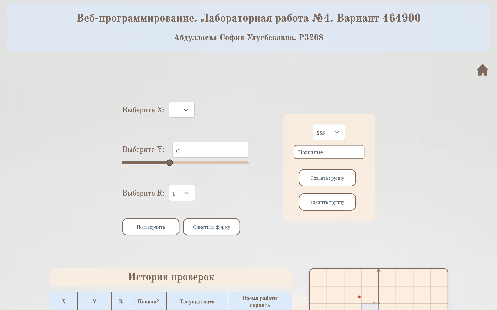
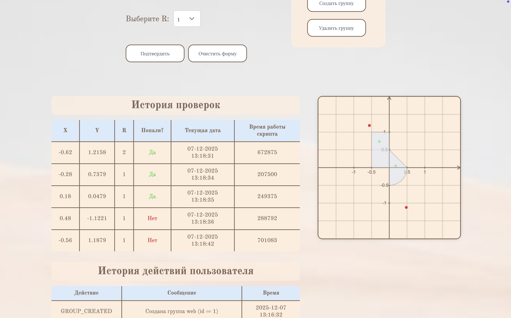
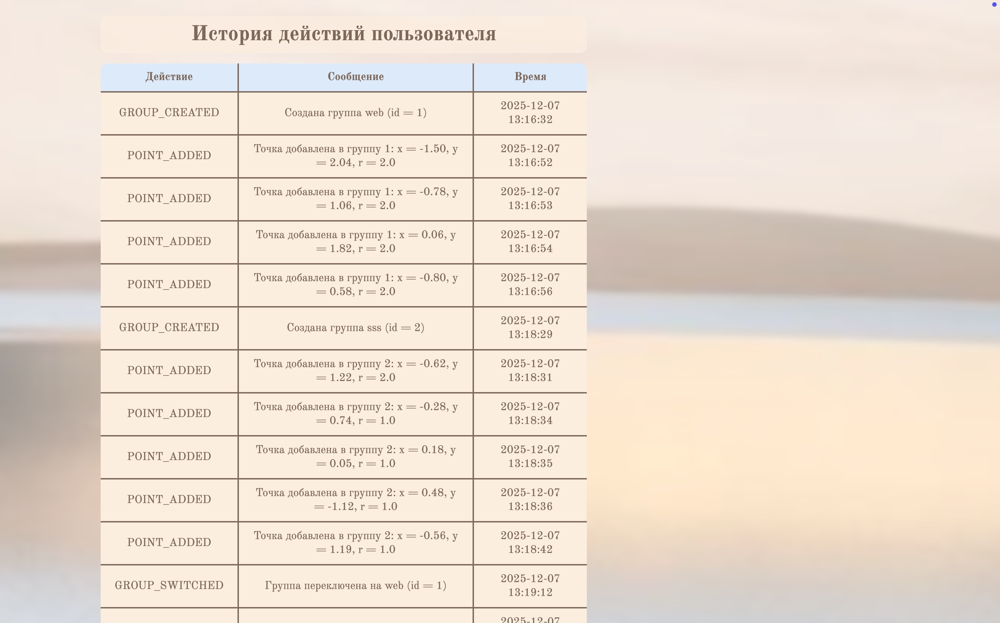

# Лабораторная работа №4
## Технологический стек

**Backend:** JAX-RS

**Frontend**: React

**Управление состоянием**: RTK Query

**Хранение значений**: Postgres (Hibernate в качестве ORM)

**Интеграция frontend**: Webpack Module Federation

## Задача 
Функциональность приложения расширяется. Помимо проверки попадания точки в область система ведет историю запросов и вводит возможность сохранять “группы результатов попаданий”.
Группа результатов попаданий - абстракция, позволяющая пользователю логически объединять результаты проверок. 
Пользователь может:
1.  **Создать** новую группу
2.  **Активировать** существующую группу (сделать ее текущей)
3.  **Заполнить** текущую группу новыми результатами проверок
4.  **Удалить** группу
5.  **При переключении между группами** перезапрашиваются точки в таблице результатов и перерисовывается график

### Фронтенд
Состоит из двух микрофронтендов, построенных на одном фреймворке. Оба микрофронта интегрируются в единое приложение через механизм модульной федерации Webpack.

- Первый микрофронт представляет собой форму ввода координат точки и элемент интерфейса для запуска проверки
- Второй микрофронт отвечает за отображение таблицы результатов, графика и истории запросов пользователя

Используется **глобальный стор (RTK Query)** для обмена данными между микрофронтами

### Бэкенд
Состоит из трех микросервисов: **Auth, Geometry и History**

- **Auth** выполняет регистрацию и аутентификацию пользователей, выдает JWT-токены для авторизации запросов
- **Geometry** осуществляет геометрический расчет попадания точки и теперь заведует группами точек и их функционалом. Также выполняет POST запрос к сервису History для регистрации действий пользователя
- **History** отвечает за сохранение действий пользователя и отправку истории запросов пользователя. Он принимает запросы на сохранение действий от сервиса Geometry.

### База данных и ORM
Каждый микросервис оперирует своей **независимой схемой данных** в **Postgres**. Взаимодействие с БД осуществляется через ORM **Hibernate**

## Интерфейс

